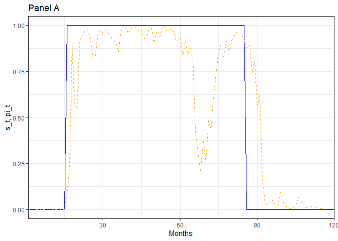
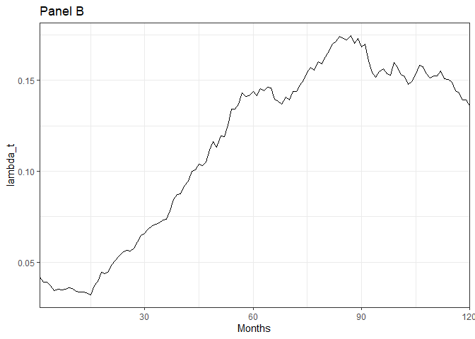
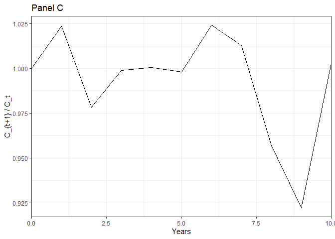
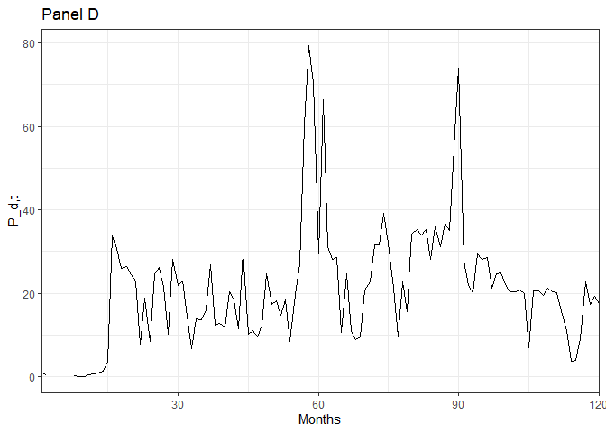

<!-- README.md is generated from README.Rmd. Please edit that file -->

# GKS2022

<!-- badges: start -->
<!-- badges: end -->

## Introduction

The code in this document is kept to a minimum. All the logic is
implemented in functions. I only cover high-level functions.

## Setup

Make sure to install missing packages with
`install.packages("missing-package")`. This package is not on CRAN so it
must be installed from Github with the following command:

``` r
# remotes::install_github("DavidBarke/GKS_2022")
```

``` r
library(GKS2022)
library(ggplot2)
library(tibble)
library(pracma)
library(cli)
```

## Parameters

The function `ghaderi_params()` can be used to set the parameter values
of the model. It outputs a list that can be passed to most of the other
functions. The default values for the parameters are the ones used by
@Ghaderi_2022.

``` r
str(ghaderi_params())
#> List of 18
#>  $ gamma                  : num 5
#>  $ psi                    : num 1.5
#>  $ delta                  : num 0.999
#>  $ mu_c                   : num 0.0026
#>  $ sigma_c                : num 0.002
#>  $ phi                    : num 3
#>  $ rho_lambda             : num 0.993
#>  $ sigma_lambda           : num 0.0083
#>  $ lambda_L               : num 0.0417
#>  $ lambda_H               : num 0.417
#>  $ mu_Z                   : num 0.02
#>  $ p_01                   : num 0.0017
#>  $ p_10                   : num 0.0208
#>  $ p_00                   : num 0.998
#>  $ p_11                   : num 0.979
#>  $ theta                  : num -12
#>  $ long_run_mean_lambda_t1:function (s_t1)  
#>   ..- attr(*, "srcref")= 'srcref' int [1:8] 49 31 51 5 31 5 246 248
#>   .. ..- attr(*, "srcfile")=Classes 'srcfilealias', 'srcfile' <environment: 0x000002701cd19020> 
#>  $ Phi_Z                  :function (x)  
#>   ..- attr(*, "srcref")= 'srcref' int [1:8] 52 13 54 5 13 5 249 251
#>   .. ..- attr(*, "srcfile")=Classes 'srcfilealias', 'srcfile' <environment: 0x000002701cd19020>
```

## Fixed-point iteration

The function `fixed_point_iteration_pc` can be used to perform the
(incorrect) fixed-point iteration for the wealth consumption ratio. The
following code chunk outlines its logic.

``` r
n <- 10 # Number of grid points
K <- 20 # Number of iterations

# Create a grid for lambda and pi
lambda <- linspace(log(0.005), log(11), n)
lambda <- exp(lambda)
pi <- linspace(0, 1, n)

pc_k <- pc_k1 <- ones(length(pi), length(lambda))

pc <- function(lambda_t, pi_t) {
  interp2(lambda, pi, pc_k, lambda_t, pi_t)
}

for (k in 1:K) { # loop over iterations
  for (i in 1:n) { # loop over lambda
    for (j in 1:n) { # loop over pi
      # j, i is not a mistake. interp2 expects pc_current in pi x lambda format
      # pc_t computes the right-hand side of equation 8
      pc_k1[j,i] <- pc_t(pc, lambda[i], pi[j])
    }
  }
  pc_k <- pc_k1
  cli_alert_info("Iteration {k}: avg. value: {1/n^2 * sum(pc_k)}")
}
```

As you can see the average wealth-consumption ratio increases with every
iteration which is undesirable. The difference between subsequent
iterations gets smaller but @Ghaderi_2022 suggest that the true average
value should be around $1/3$.

## Figure 2: Learning Dynamics, Intensity Process, Consumption Growth

I replicate figure 2. First, I set the state variable $s_{t}$

``` r
s_t <- rep(c(0, 1, 0), times = c(15, 70, 35))
```

Among other things, the function `simulation()` simulates the intensity
process $\lambda_t$, belief evolution $\pi_t$, aggregate consumption
growth process $\Delta c_t$, and price of a dividend claim $P_{d,t}$.

``` r
sim <- simulation(s_t, pc_grid, pd_grid)

str(sim)
#> List of 2
#>  $ data  : tibble [120 × 15] (S3: tbl_df/tbl/data.frame)
#>   ..$ t             : int [1:120] 1 2 3 4 5 6 7 8 9 10 ...
#>   ..$ s_t           : num [1:120] 0 0 0 0 0 0 0 0 0 0 ...
#>   ..$ lambda_t      : num [1:120] 0.0417 0.0406 0.0369 0.0375 0.0367 ...
#>   ..$ pi_t          : num [1:120] 0.00 2.13e-04 2.27e-05 9.05e-04 3.34e-04 ...
#>   ..$ delta_c_t     : num [1:120] 0 0.00813 0.00459 0.00733 0.00327 ...
#>   ..$ shock_lambda_t: num [1:120] 1.536 -0.661 -2.199 0.379 -0.53 ...
#>   ..$ shock_c_t     : num [1:120] -0.172 2.767 0.993 2.365 0.334 ...
#>   ..$ J_t           : num [1:120] -2.26e-03 8.67e-19 4.34e-19 0.00 0.00 ...
#>   ..$ C_t           : num [1:120] 0.348 0.351 0.352 0.355 0.356 ...
#>   ..$ pc_t          : num [1:120] 3.42 3.42 3.41 3.41 3.41 ...
#>   ..$ pd_t          : num [1:120] 3.17 2.43 NA NA NA ...
#>   ..$ PC_t          : num [1:120] 30.5 30.5 30.2 30.3 30.2 ...
#>   ..$ PD_t          : num [1:120] 23.8 11.4 NA NA NA ...
#>   ..$ P_C_t         : num [1:120] 10.6 10.7 10.6 10.7 10.7 ...
#>   ..$ P_D_t         : num [1:120] 1 0.491 NA NA NA ...
#>  $ params:List of 18
#>   ..$ gamma                  : num 5
#>   ..$ psi                    : num 1.5
#>   ..$ delta                  : num 0.999
#>   ..$ mu_c                   : num 0.0026
#>   ..$ sigma_c                : num 0.002
#>   ..$ phi                    : num 3
#>   ..$ rho_lambda             : num 0.993
#>   ..$ sigma_lambda           : num 0.0083
#>   ..$ lambda_L               : num 0.0417
#>   ..$ lambda_H               : num 0.417
#>   ..$ mu_Z                   : num 0.02
#>   ..$ p_01                   : num 0.0017
#>   ..$ p_10                   : num 0.0208
#>   ..$ p_00                   : num 0.998
#>   ..$ p_11                   : num 0.979
#>   ..$ theta                  : num -12
#>   ..$ long_run_mean_lambda_t1:function (s_t1)  
#>   .. ..- attr(*, "srcref")= 'srcref' int [1:8] 49 31 51 5 31 5 246 248
#>   .. .. ..- attr(*, "srcfile")=Classes 'srcfilealias', 'srcfile' <environment: 0x000002701cd19020> 
#>   ..$ Phi_Z                  :function (x)  
#>   .. ..- attr(*, "srcref")= 'srcref' int [1:8] 52 13 54 5 13 5 249 251
#>   .. .. ..- attr(*, "srcfile")=Classes 'srcfilealias', 'srcfile' <environment: 0x000002701cd19020>
```



The price of the dividend claim is obviously wrong.

``` r
ggplot(sim$data) +
  geom_line(aes(x = t, y = P_D_t), color = "black") +
  theme_bw() +
  labs(
    title = "Panel D",
    x = "Months",
    y = "P_d,t"
  ) +
  scale_x_continuous(
    expand = c(0, 0)
  )
```



# Asset Pricing Moments

I would have liked to reproduce the simulations they did but without a
correct price-dividend ratio this is a pointless endeavor.
